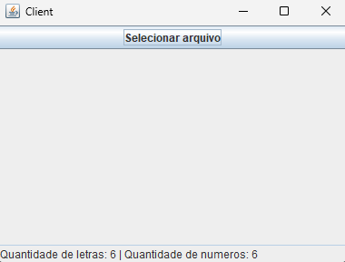

# Arquitetura Mestre-Escravo com Paralelismo

Projeto desenvolvido para a disciplina de Sistemas Distribuídos da UFPI, utilizando Python, Flask e SQLite para envio, processamento e exibição de imagens em um sistema cliente-servidor estruturado em três camadas.

---

### Funcionalidades:
- **Servidor Mestre**: Recebe as requisições e dispara duas threads paralelas, cada uma responsável por se comunicar com um servidor escravo para contar letras e números.
- **Escravo 1**: Conta o número de **letras** no texto (endpoint `/letras`).
- **Escravo 2**: Conta o número de **números** no texto (endpoint `/numeros`).
- **Docker**: Todos os componentes (Mestre, Escravo 1 e Escravo 2) estão **containerizados** usando Docker, permitindo fácil implantação e testes em ambientes isolados.
- **Cliente**: Uma aplicação simples em Java Swing que permite ao usuário selecionar um arquivo `.txt`, ler seu conteúdo e enviá-lo ao servidor mestre para processamento.

---

## 📥 **Como executar**

### 🔧 **Requisitos**

- ✅ **Docker e Docker Compose**
- ✅ **Java 17 ou superior**

---

### 1️⃣ **Clone o repositório**

```bash
git clone https://github.com/melissaoalves/multi-threaded-parallel-processing.git 
cd multi-threaded-parallel-processing
```

### 🖥 **Servidor**

### 1️⃣ **Construa e inicie os containers**
```bash
docker-compose up --build
```

### 💻 **Cliente**

### 1️⃣ **Em outro terminal, execute:**

```bash
javac Cliente/src/main/java/ClienteApp.java
java Cliente/src/main/java/ClienteApp.java
```

### 2️⃣ **Clique no botão “Selecionar arquivo” e selecione um arquivo .txt do seu computador.**

### 3️⃣ **O servidor receberá, processará e retornará a quantidade de letras e númeroS deste arquivo.**

---

## 📸 _Prints da Interface_

### 🔹 _Interface Gráfica_



---

## 👨‍💻 **Autores**

**Davi Rodolfo e Melissa Alves**
